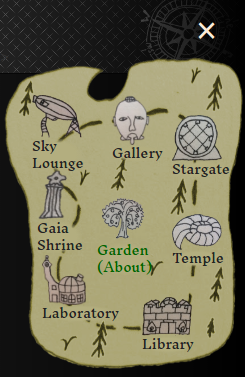
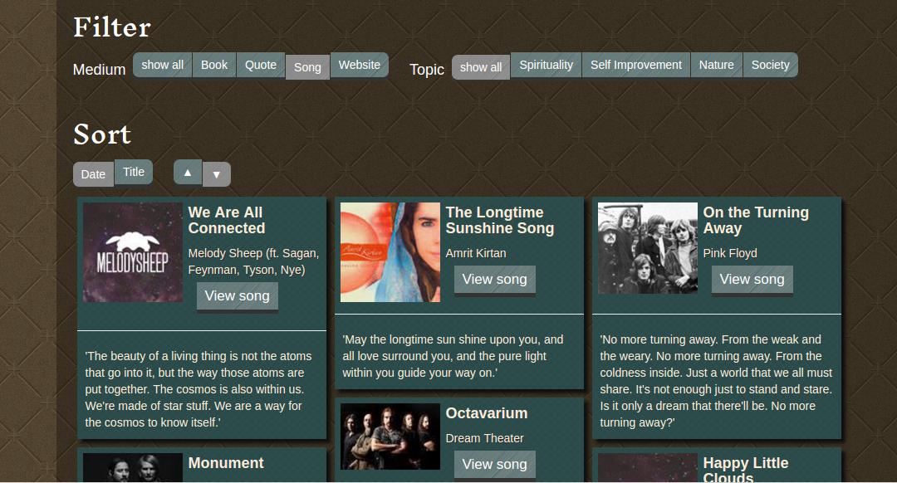

# Artopia

My personal portfolio and blog showcasing art and ideas for inspiring a new paradigm of consciousness.

**Live site:** https://ashmystic.github.io/artopia

## Technical Details

Website Framework: **Jekyll static website generator**

Theme Design: **Custom Bootstrap Theme**

Hosting Platform: **Github Pages**

Languages Leveraged: **HTML5, CSS3, Javascript**

Javascript Libraries Consumed: **jQuery, Metafizzy Isotope & Flickity, ImagesLoaded, Google Analytics**

## Licensed Content

All original works (including writings, drawings and photos) included in this repository are original works by Andrew Herman and are licensed under <a href="https://creativecommons.org/licenses/by-nc-sa/4.0" target="_blank">Creative Commons BY-NC-SA</a>.

## Site Structure

### Sitemap

The sitemap consists of a home page (index) and several _Category_ pages. These are at the root directory level defined by Markdown (.md) files. At build-time Jekyll builds each page based on the YAML data in each file.

### Item Portfolios

Each page includes a rectangular portfolio grid, which displays a set of informational cards that are filtered based on the category they are in. The data for these cards is kept in the __portfolio-items_ folder as Markdown files. These also get processed by Jekyll at build-time based on their YAML data.

### Other assets

HTML layouts are kept in the __layouts_ folder and partial templates in the __includes_ folder. All other data (CSS, Javascript, fonts, images) are kept in the _assets_ folder.
